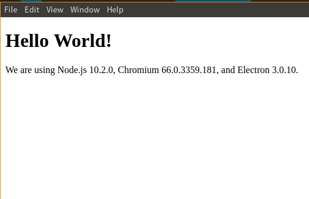

# 初试electron

node.js npm安装好之后，

```
npm run start
```


## 运行

可运行得下图：



运行所需要的文件：

- `package.json` - 指向app的主程序，列出app的细节和依赖。如app名称，版本，描述，关键字，作者，等细节。如果要打包程序，打包信息也要在这里描述,包括图标，背景等所有需要的东西。
- `main.js` -app的主程序，来开始运行app，生成一个浏览器窗口来渲染html
- `index.html` - 即本例中要渲染的网页

## 打包

上例中的package.json改为listen1中的相应文件，可以打包为appiamge/deb/tar.gz,参见dist下。

```
npm run dist:liunxx64
```


# electron-quick-start

**Clone and run for a quick way to see Electron in action.**

This is a minimal Electron application based on the [Quick Start Guide](https://electronjs.org/docs/tutorial/quick-start) within the Electron documentation.

**Use this app along with the [Electron API Demos](https://electronjs.org/#get-started) app for API code examples to help you get started.**

A basic Electron application needs just these files:

- `package.json` - Points to the app's main file and lists its details and dependencies.
- `main.js` - Starts the app and creates a browser window to render HTML. This is the app's **main process**.
- `index.html` - A web page to render. This is the app's **renderer process**.

You can learn more about each of these components within the [Quick Start Guide](https://electronjs.org/docs/tutorial/quick-start).

## To Use

To clone and run this repository you'll need [Git](https://git-scm.com) and [Node.js](https://nodejs.org/en/download/) (which comes with [npm](http://npmjs.com)) installed on your computer. From your command line:

```bash
# Clone this repository
git clone https://github.com/electron/electron-quick-start
# Go into the repository
cd electron-quick-start
# Install dependencies
npm install
# Run the app
npm start
```

Note: If you're using Linux Bash for Windows, [see this guide](https://www.howtogeek.com/261575/how-to-run-graphical-linux-desktop-applications-from-windows-10s-bash-shell/) or use `node` from the command prompt.

## Resources for Learning Electron

- [electronjs.org/docs](https://electronjs.org/docs) - all of Electron's documentation
- [electronjs.org/community#boilerplates](https://electronjs.org/community#boilerplates) - sample starter apps created by the community
- [electron/electron-quick-start](https://github.com/electron/electron-quick-start) - a very basic starter Electron app
- [electron/simple-samples](https://github.com/electron/simple-samples) - small applications with ideas for taking them further
- [electron/electron-api-demos](https://github.com/electron/electron-api-demos) - an Electron app that teaches you how to use Electron
- [hokein/electron-sample-apps](https://github.com/hokein/electron-sample-apps) - small demo apps for the various Electron APIs

## License

[CC0 1.0 (Public Domain)](LICENSE.md)
